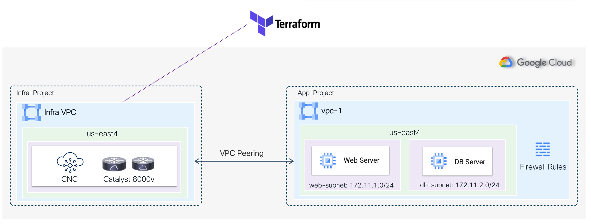

## Sample [terraform](https://www.terraform.io) code with [Cisco Cloud Network Controller](https://www.cisco.com/c/en/us/solutions/data-center-virtualization/application-centric-infrastructure/cloud-network-controller.html)

This project shows how Cloud Network Controller (CNC) works on GCP, how it normalizes and translates a cloud-like policy model into public cloud native constructs, and how Terraform can be leveraged to automate CNC operations.

**High Level Diagram**



 **Use Case: Single Region/Tenant/VRF**

Using standard terraform modules, the code builds a single VPC on us-east4 region and enable peering with the infra VPC where CNC is deployed with cloud routers, it then creates two EPGs (Web & DB) which translates to firewall rules, and enable Web access from Internet using contracts.

**Pre-requisites**

CNC running on a dedicated GCP project. All credentials and sensitive data are defined in a .tfvars file.

**Providers**

| Name      | Version |
| --------- | ------- |
| [aci](https://registry.terraform.io/providers/CiscoDevNet/aci/latest)|  >=2.7.0   |

**Installation**

1. Install and set up your [terraform](https://www.terraform.io/downloads.html) environment
2. Clone/copy the .tf files (main.tf, variables.tf, and provider.tf) onto your terraform environment
3. Create a terraform.tfvars file with your CNC credentials and GCP project used for the user project/VPC

**Usage**
```
terraform init
terraform plan
terraform apply
```
